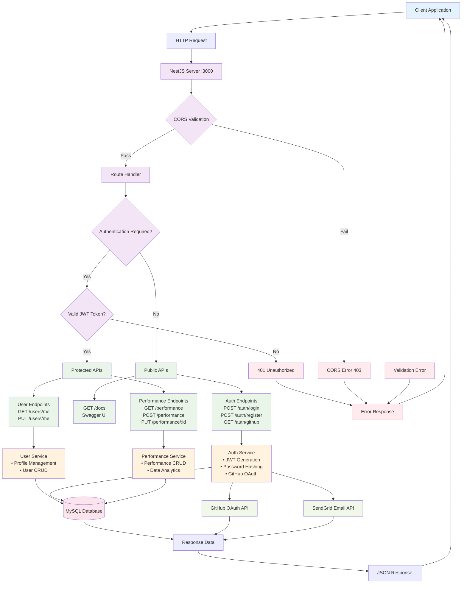

# 1. 프로젝트 소개
## 1.1. 개발배경 및 필요성
### 1.1.1 협업툴은 넘쳐나지만, 여전히 수작업으로 관리되는 개발자 성과
스타트업과 테크기업의 실무자들은 GitHub, Jira, Notion 등 다양한 협업툴을 동시에 3개 이상 병행 사용한다. 그러나 성과를 정리하고 평가에 활용하기 위한 통합된 워크플로우는 부재하다. 결국 분기나 연말마다 커밋 기록, 이슈 완료 내역, 문서 작성 사항을 각 툴에서 수작업으로 복사·첨부하며 비효율적인 업무를 반복하게 된다.

### 1.1.2 성과 관리 영역의 공백
많은 기업들이 협업툴을 도입했지만 성과 관리와 직접적으로 연동되는 솔루션은 존재하지 않는다. CEB 조사에 따르면 인사평가 시즌마다 직원 1인당 약 40시간을 성과 관련 활동에 사용하고, 관리자는 연간 평균 210시간을 소비한다. 인사 담당자 중 88%는 자사의 성과 관리가 잘 이뤄지지 않는다고 답했다. 이는 합리적이고 효율적인 성과 관리 솔루션의 필요성을 잘 보여준다.

### 1.1.3 기존 성과 관리 방식의 한계
성과 관리는 구성원의 몰입도를 높이고 기업의 손실을 줄이는 중요한 활동이다. Gallup 연구에 따르면 업무 몰입 부족으로 인한 손실 비용은 연간 9,600억~1조 2,000억 달러에 달한다. 최근 360도 평가 등 다면평가 방식이 확산되며, 구성원들은 자신의 성과 자료를 서술해야 하지만 현재 방식은 다음과 같은 한계를 가진다.
- 각 툴에 흩어진 데이터를 복사·첨부해야 하며, 누락·오류 가능성이 높음
- 스프레드시트·문서로 수동 정리해야 하고, 권한 관리·공유가 번거로움
- 자체 개발 솔루션은 오류 가능성과 운영 부담이 크고, 개발자 의존도가 높음

따라서 협업툴 기반의 성과 데이터를 연동하고, 이를 평가에 바로 활용할 수 있는 데이터 기반 성과 관리 솔루션(Moti)의 필요성이 제기된다. 이는 기업의 성과 관리 공백을 메우고, 피평가자와 평가자 모두의 업무 효율을 획기적으로 개선할 수 있다.

## 1.2. 개발 목표 및 주요 내용
### 1.2.1 개발 목표
협업툴(Jira, GitHub, Notion 등)과 연동되는 성과 관리 통합 플랫폼 완성
피평가자와 평가자를 동시에 지원하는 양방향 AI 평가 지원 기능 구현
성과 관리 과정의 효율성과 객관성 확보
국내 HR SaaS 시장 선도 및 글로벌 SaaS 플랫폼(Product Hunt, G2 등) 입점 기반 마련

### 1.2.2 주요 내용
MVP 고도화: 기존 성과 작성·불러오기·협업툴 연동 기능 개선
AI 기반 기능 개발:
피평가자용 자기평가 참고 자료 자동 생성
평가자용 성과 평가 리포트 초안 생성
UI/UX 강화: Drag&Drop, 자동 요약, 기간별 성과 조회 등 사용자 편의성 강화

## 1.3. 세부내용
### 1.3.1 협업툴 연동 기반 성과 수집
Jira, GitHub, Notion 등 주요 협업툴과 연동하여 성과 데이터를 자동으로 불러옴
- 프로젝트별 성과 데이터 자동 수집
- 기간 필터링(예: 분기별, 반기별 성과)
- 이슈, PR, 문서 등 구체적 근거 데이터 연결

### 1.3.2 성과 작성 및 관리
사용자가 본인의 성과를 직접 기록하고 근거를 첨부/수정할 수 있는 기능
- 프로젝트 단위 성과 작성
- Drag&Drop 방식으로 근거(링크, 문서, 스크린샷) 첨부
- 성과 이력 조회 및 수정 가능

### 1.3.3 AI 기반 평가 리포트 초안 생성 (평가자용, 향후 확장)
평가자를 위한 AI 성과 평가 리포트 자동 초안 생성 기능
- 성과 데이터를 기반으로 핵심 성과 요약
- 평가 지표(기여도, 코드 품질, 문제 해결 능력 등) 반영
- 평가자가 검토·보완할 수 있는 리포트 초안 제공

### 1.3.4 AI 기반 평가 참고 자료 생성 (피평가자용, 향후 확장)
피평가자가 작성한 성과 데이터를 AI가 분석하여, 자기평가 및 제출용 참고 자료를 자동으로 생성하는 기능
- 성과 데이터를 기반으로 핵심 기여도 및 주요 성과 요약
- 개인 강점 및 개선점 자동 도출
- 성과와 조직 KPI/OKR 간 자동 매핑
- 자기평가 및 제출용 문서/보고서 형태로 정리 (예: 분기 성과 요약 PDF)

### 1.3.5 MVP 제작 완료
1) 협업툴 연동 기능
성과 작성 시 협업툴(깃허브) 연동 가능, 협업 정보 조회 시 기간 필터링 가능
2) 성과 작성 기능
사용자는 본인의 성과를 프로젝트 단위로 작성, 수정할 수 있음. (Drag & Drop 방식)
3) 성과 불러오기 기능
본인이 작성한 성과를 불러 올 수 있음. 조회 시 기간 필터링 가능


## 1.4. 기존 서비스 대비 차별성
‣ 협업툴 연동 기반의 데이터 중심 성과 관리
- 기존 HR 평가 솔루션은 대부분 자가보고식 성과 기록에 의존하나, moti는 Jira, GitHub, Notion등 실제 협업툴과 자동 연동하여 성과 데이터를 수집함.
- 이를 통해 보고서 중심 평가에서 벗어나 객관적 근거 기반의 성과 관리가 가능함.

‣ 피평가자와 평가자를 모두 지원하는 AI 기능
경쟁 서비스는 평가자(관리자) 중심 기능에 치중되어 있으나, moti는 피평가자용 AI 자기평가 참고자료와 평가자용 AI 리포트 초안을 동시에 제공함.
이를 통해 성과 관리 과정에서 양측 모두의 편의성을 지원하는 구조를 구축함.

‣ 성과 관리 편의성 극대화 (UX/UI)
드래그앤드롭 방식으로 근거 자료를 첨부하고, 기간별 성과 조회와 자동 요약 기능을 제공함.
복잡한 입력 폼 대신 직관적이고 간편한 UX를 제공하여 사용자의 작성 부담을 최소화함.

‣ 글로벌 확장성을 고려한 API·Marketplace 전략
단순 SaaS 제공을 넘어 Jira, Notion, GitHub 등 글로벌 협업툴 마켓플레이스 입점 및 API 제공을 계획함.
이를 통해 국내 SaaS에 머무르지 않고 글로벌 SaaS 생태계로 확장할 수 있는 차별적 경쟁력을 확보함.

## 1.5. 사회적가치 도입 계획
- 근로자의 업무 효율성과 삶의 균형 제고
성과 자료 자동화 및 AI 평가 지원을 통해 불필요한 수작업을 줄임.
근로자의 과도한 성과 보고 부담을 완화하고 워라밸을 증진시킴.
- 공정하고 투명한 평가 문화 확산
협업툴 데이터를 기반으로 객관적 성과를 확보함.
평가자의 주관 개입을 최소화하여 공정한 인사평가를 가능하게 함.
- 중소기업·스타트업 경쟁력 강화
저비용 SaaS 도입으로 대기업 수준의 성과 관리 체계를 갖출 수 있게 함.
인적 자원 관리의 효율성을 높여 기업 경쟁력 향상에 기여함.


# 2. 상세설계
## 2.1. 시스템 구성도


## 2.2. 사용 기술

| 이름                  | 버전    |
|:---------------------:|:-------:|
| Node.js               | 20.11.1 |
| Nest.js               | 11.0.1  |
| Node.js(frontend)     | 22.17.0 |
| Next.js               | 15.4.5  |

# 3. 개발결과
## 3.1. 전체시스템 흐름도


## 3.2. 기능설명

### 3.2.1 회원가입 페이지
- 이메일 주소를 입력하면 입력창에서 유효성 검사가 진행됩니다.
- 인증링크 전송을 누르면 입력한 이메일로 인증 링크가 전송됩니다.
- 이메일로 전송된 링크에 접속하여 이름을 추가 입력하여 회원가입을 완료할 수 있습니다.

### 3.2.2 로그인 페이지
- 이메일 주소를 입력하면 입력창에서 유효성 검사가 진행됩니다.
- 인증코드 전송을 누르면 입력한 이메일로 인증 코드가 발송됩니다.
- 이메일로 전송된 코드를 복사하여 로그인 코드 입력 모달에 붙여넣으면 엑세스 토큰이 발급되며 로그인이 완료됩니다.

### 3.2.3 협업툴 연동페이지
- 상단 네비게이션 바에서 연동할 협업툴을 선택합니다.
- 선택한 협업툴의 연동 버튼을 클릭합니다.
- 해당 서비스의 연동 로그인 창에서 로그인을 진행합니다.
- 로그인이 완료되면 해당 협업툴에서 정보를 불러옵니다. (ex. GITHUB PR)

### 3.2.4 성과 관리 페이지
- 성과 관리 페이지에서 프로젝트 추가 버튼을 클릭합니다.
- 성과 제목, 기간, 설명(Description), 기여(Contribution), 성과(Outcome)을 작성합니다.
- 성과는 작성 중간중간 자동 저장되면 최종 저장하면 read-only 모드로 변경됩니다.
- 아래로 스크롤하여 다른 성과를 불러올 수 있습니다.
- 협업툴에서 불러온 정보를 drag and drop 하여 chip 형태로 참조할 수 있습니다.


## 3.3. 기능명세서
### 3.3.1 회원가입 페이지 (User Registration)

#### 3.3.1.1 기능 개요
이메일 기반 회원가입 시스템으로 이메일 인증을 통한 계정 생성

#### 3.3.1.2 상세 기능
| 기능ID | 기능명 | 상세 설명 | 우선순위 |
|--------|--------|-----------|----------|
| UR-001 | 이메일 입력 및 유효성 검사 | 실시간 이메일 형식 검증 (RFC 5322 표준) | High |
| UR-002 | 인증링크 전송 | 입력된 이메일로 회원가입 인증링크 발송 | High |
| UR-003 | 이메일 인증 처리 | 인증링크 클릭 시 토큰 검증 및 계정 활성화 | High |
| UR-004 | 추가 정보 입력 | 인증 완료 후 사용자 이름 입력 | High |
| UR-005 | 회원가입 완료 | 모든 정보 입력 완료 후 계정 생성 | High |

#### 3.3.1.3 입력/출력 명세
- **입력**: 이메일 주소, 사용자 이름
- **출력**: 인증링크 전송 확인, 회원가입 완료 메시지
- **검증 규칙**: 
  - 이메일: 필수, 유효한 형식, 중복 불가
  - 이름: 필수, 2-50자, 특수문자 제한

### 3.3.2 로그인 페이지 (User Authentication)

#### 3.3.2.1 기능 개요
이메일과 인증코드를 이용한 무비밀번호 로그인 시스템

#### 3.3.2.2 상세 기능
| 기능ID | 기능명 | 상세 설명 | 우선순위 |
|--------|--------|-----------|----------|
| LA-001 | 이메일 입력 및 검증 | 등록된 이메일 주소 확인 | High |
| LA-002 | 인증코드 전송 | 6자리 숫자 인증코드 이메일 발송 | High |
| LA-003 | 인증코드 입력 모달 | 인증코드 입력을 위한 모달 창 표시 | High |
| LA-004 | 인증코드 검증 | 입력된 코드와 발송된 코드 일치 확인 | High |
| LA-005 | 액세스 토큰 발급 | JWT 토큰 생성 및 클라이언트 전달 | High |
| LA-006 | 로그인 완료 처리 | 토큰 저장 및 메인 페이지 리다이렉션 | High |

#### 3.3.2.3 입력/출력 명세
- **입력**: 이메일 주소, 6자리 인증코드
- **출력**: 인증코드 전송 확인, JWT 액세스 토큰
- **보안 요구사항**: 
  - 인증코드 5분 만료
  - 최대 3회 시도 제한
  - 토큰 24시간 유효

### 3.3.3 협업툴 연동페이지 (Collaboration Tool Integration)

#### 3.3.3.1 기능 개요
GitHub, Jira, Slack 등 다양한 협업툴과의 OAuth 연동

#### 3.3.3.2 상세 기능
| 기능ID | 기능명 | 상세 설명 | 우선순위 |
|--------|--------|-----------|----------|
| CT-001 | 협업툴 선택 네비게이션 | 상단 탭에서 연동 가능한 협업툴 목록 표시 | High |
| CT-002 | 연동 버튼 클릭 처리 | 선택한 협업툴의 OAuth 인증 시작 | High |
| CT-003 | OAuth 인증 처리 | 외부 서비스 로그인 창 팝업 및 인증 | High |
| CT-004 | 연동 완료 처리 | 인증 토큰 저장 및 연동 상태 업데이트 | High |
| CT-005 | 데이터 동기화 | 연동된 협업툴에서 정보 조회 및 저장 | Medium |
| CT-006 | 연동 해제 | 기존 연동 해제 및 토큰 삭제 | Medium |

#### 3.3.3.3 지원 협업툴
- **GitHub**: Pull Request, Issues, Commits
- **Jira**: Issues, Projects, Sprints
- **Slack**: Messages, Channels, Files
- **Notion**: Pages, Databases

#### 3.3.3.4 입력/출력 명세
- **입력**: 협업툴 선택, OAuth 인증 정보
- **출력**: 연동 상태, 동기화된 데이터 목록

### 3.3.4 성과 관리 페이지 (Performance Management)

#### 3.3.4.1 기능 개요
프로젝트 성과를 체계적으로 작성, 관리하는 시스템

#### 3.3.4.2 상세 기능
| 기능ID | 기능명 | 상세 설명 | 우선순위 |
|--------|--------|-----------|----------|
| PM-001 | 프로젝트 추가 | 새로운 성과 항목 생성 | High |
| PM-002 | 성과 정보 입력 | 제목, 기간, 설명, 기여, 성과 작성 | High |
| PM-003 | 자동 저장 | 5초마다 또는 내용 변경 시 임시 저장 | High |
| PM-004 | 최종 저장 | 작성 완료 후 읽기 전용 모드 전환 | High |
| PM-005 | 성과 목록 조회 | 무한 스크롤로 기존 성과 불러오기 | High |
| PM-006 | 드래그 앤 드롭 | 협업툴 데이터를 칩 형태로 참조 추가 | Medium |
| PM-007 | 성과 수정 | 읽기 전용 해제 후 내용 수정 | Medium |
| PM-008 | 성과 삭제 | 확인 후 성과 항목 삭제 | Medium |
| PM-009 | 성과 검색 | 제목, 내용 기반 검색 기능 | Low |
| PM-010 | 성과 필터링 | 기간, 태그, 상태별 필터 | Low |

## 3.4. 디렉토리 구조
```
/
├── client/                     # 프론트엔드 (Next.js)
│   ├── build/                  # webpack 및 빌드 설정 파일
│   │   ├── webpack.config.js
│   │   └── vite.config.js
│   ├── config/                 # 프로젝트 설정 파일
│   │   ├── env.config.js
│   │   └── api.config.js
│   ├── deploy/                 # 배포 설정 파일
│   │   ├── dockerfile
│   │   └── nginx.conf
│   ├── src/                    # 소스 코드
│   │   ├── assets/             # 이미지, 폰트 등의 정적 파일
│   │   │   ├── images/
│   │   │   └── fonts/
│   │   ├── pages/              # 화면에 나타나는 페이지
│   │   │   ├── auth/           # 인증 관련 페이지 (sign-in, sign-up)
│   │   │   ├── dashboard/      # 대시보드 페이지
│   │   │   └── components/     # 여러 페이지에서 공통적으로 사용되는 컴포넌트
│   │   ├── router/             # 라우터
│   │   │   ├── index.js
│   │   │   └── routes.js
│   │   ├── store/              # 글로벌 상태 관리 (Redux/Zustand)
│   │   │   ├── slices/
│   │   │   └── index.js
│   │   ├── styles/             # 스타일 파일
│   │   │   ├── globals.css
│   │   │   └── components/
│   │   └── utils/              # 유틸리티 함수
│   │       ├── api/
│   │       └── helpers/
│   └── static/                 # 정적 파일 (public)
│       ├── favicon.ico
│       └── robots.txt
├── server/                     # 백엔드 애플리케이션 (NestJS)
│   ├── src/                    # 서버 소스 코드
│   │   ├── auth/               # 인증 모듈 (JWT, GitHub OAuth)
│   │   │   ├── controllers/    # 인증 컨트롤러
│   │   │   ├── services/       # 인증 서비스
│   │   │   └── dto/            # 데이터 전송 객체
│   │   ├── users/              # 사용자 관리 모듈
│   │   │   ├── controllers/    # 사용자 컨트롤러
│   │   │   ├── services/       # 사용자 서비스
│   │   │   └── entities/       # 사용자 엔티티
│   │   ├── performance/        # 성과 관리 모듈
│   │   │   ├── controllers/    # 성과 컨트롤러
│   │   │   ├── services/       # 성과 서비스
│   │   │   └── entities/       # 성과 엔티티
│   │   ├── common/             # 공통 모듈 (가드, 파이프, 데코레이터)
│   │   ├── config/             # 설정 파일 (데이터베이스, JWT 등)
│   │   └── environments/       # 환경별 설정 파일
│   ├── scripts/                # 배포 및 운영 스크립트
│   │   ├── application_start.sh # 애플리케이션 시작 스크립트
│   │   ├── nginx-utils.sh      # Nginx 유틸리티
│   │   └── ssl-manager.sh      # SSL 인증서 관리
│   ├── nginx/                  # Nginx 설정 파일
│   ├── docker/                 # Docker 관련 파일
│   │   ├── Dockerfile          # 도커 이미지 빌드 파일
│   │   └── docker-compose.yml  # 로컬 개발용 컴포즈
│   └── package.json            # 서버 의존성
├── .github/                    # GitHub Actions 워크플로우
├── docker-compose.yml          # 전체 프로젝트 컴포즈
├── package.json                # 루트 의존성 (workspaces)
└── README.md                   # 프로젝트 개요
```

# 4. 설치 및 사용 방법
## 4.1 server 실행
- npm install
- npm run start
- .env 파일 필요 (보안상 업로드 불가, 필요시 요청 요망)

## 4.2 client 실행
- npm install
- npm run start
- .env 파일 필요 (보안상 업로드 불가, 필요시 요청 요망)

# 5. 소개 및 시연 영상

## 5.1 프로젝트 소개
Moti는 개발자와 팀을 위한 성과 관리 자동화 서비스입니다.
Jira, GitHub, Notion 같은 협업툴과 연동해, 흩어져 있는 작업 기록을 한 곳에 모아 성과를 자동으로 정리해 줍니다.
이제 번거롭게 복사·붙여넣기를 반복하지 않아도, 클릭 한 번이면 나의 성과가 정리됩니다.

또한 moti는 AI 기반 성과 평가 지원 기능을 제공합니다.
피평가자는 스스로의 성과를 돌아볼 수 있는 자기평가 참고 자료를,
평가자는 객관적인 데이터를 기반으로 한 평가 리포트 초안을 받아볼 수 있습니다.
그 결과, 누구나 더 쉽고 공정하게 평가에 참여할 수 있습니다.

moti는 성과 관리의 공백을 메우고,
누구나 편리하게 성과를 정리하고,
공정한 평가가 이루어질 수 있도록 돕는 새로운 SaaS 플랫폼입니다.

>성과 관리의 새로운 표준, Moti

## 5.2 시연 영상
https://youtu.be/xxAHdtzN4Ao

# 6. 팀 소개
| 이름 | 직무 | 역할 | 연락처 |
|--------|--------|-----------|----------|
| 김륜영 | 팀장, 백엔드 | 팀 총괄 운영, 백엔드개발 | rycando@naver.com |
| 양라윤 | 디자이너 | 디자인 | sheepra0208@naver.com |
| 정유진 | 기획자 | 기획, 마케팅 | juj02131@naver.com |
| 이준영 | 프론트엔드 | 프론트개발 | ljy03@pusan.ac.kr |
| 문진서 | 프론트엔드 | 프론트개발 | jshin27@pusan.ac.kr |


# 7. 해커톤 참여 후기
### 김륜영
제 2회 해커톤을 참가한 이후 5년만에 복학하여 다시 참가하게 된 해커톤이라 감회가 새로웠음. 5년 전에는 개발을 전혀할 줄 몰라 기획자로 참여했는데 이제는 개발 리더 역할을 하게 되어 더욱 뜻깊었음. 팀원들과 4개월동안 정말 많이 가까워졌고, 진심으로 창업을 준비하게 되면서 함께할 파트너가 생겼다는 사실에 진심으로 감사함을 느낌.

### 양라윤
이번 해커톤은 빠르게 기획된 아이디어를 시각적으로 표현하고, 그것이 실제로 개발되는 과정을 직접 경험할 수 있었다는 점에서 뜻깊었음. 한정된 시간 속에서 완성도를 높이려면 본질적인 문제 해결에 집중해야 했고, 이 과정에서 UI/UX의 핵심이 무엇인지 다시금 생각하게 되었음. 또한 기획자와 개발자와의 소통을 통해 디자인이 실제 서비스로 구현되는 경험을 얻으면서, 협업 과정의 즐거움과 성취감을 함께 느낄 수 있었음.

### 정유진
이번 해커톤을 통해 짧은 시간 안에 팀이 하나의 목표를 향해 달려가는 경험을 할 수 있었음. 처음에는 막연했던 아이디어가 팀원들과의 논의를 거치면서 점점 구체화되고, 실제 구현되는 과정을 지켜보며 큰 보람을 느꼈음. 특히 사용자 관점에서 꼭 필요한 기능이 무엇인지 고민하고, 우선순위를 정해 나가는 과정에서 많은 배움을 얻었음. 무엇보다 팀원들이 각자의 자리에서 최선을 다해 협업하는 모습을 보면서, 짧은 시간이었지만 팀워크의 소중함을 다시금 실감할 수 있었음.

### 이준영
짧은 기간 안에 결과물을 만들어야 한다는 압박감 속에서도 팀원들과 함께 집중하며 성과를 만들어가는 과정이 큰 도전이자 즐거움이었음. 제한된 시간 안에 무엇을 구현할지 결정하는 과정에서 우선순위를 명확히 하는 법을 배웠고, 디자이너와 협력해 빠르게 화면을 구현해내며 성취감을 느낄 수 있었음. 동시에 빠른 개발 속도와 코드 품질 사이에서 균형을 고민하는 경험은 앞으로의 프로젝트에도 중요한 자산이 될 것이라 생각함.

### 문진서
이번 해커톤은 아이디어가 실제 코드로 구현되어 눈앞에서 결과물로 완성되는 과정을 직접 체험할 수 있었던 값진 시간임. 팀 내에서 역할을 나누고, 코드 협업을 통해 문제를 하나씩 해결해 나가면서 개발자로서 성장할 수 있었음. 특히 짧은 기간 동안 팀원들과 긴밀히 소통하며 하나의 서비스를 완성해 나가는 과정이 매우 인상 깊었고, 이 경험이 앞으로의 협업과 프로젝트 수행에 큰 도움이 될 것이라 확신함.


<br/>

